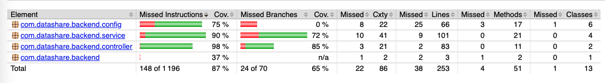
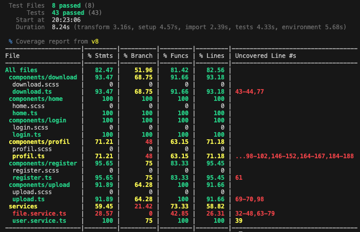
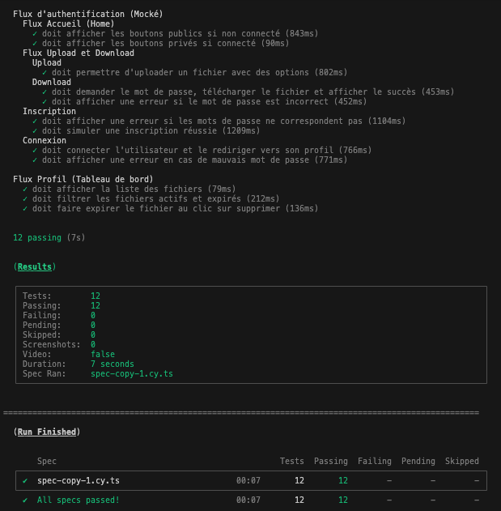

markdown_content = """# Plan de Tests – DataShare (MVP)

Ce document formalise la stratégie de test, les critères d'acceptation, les instructions d'exécution ainsi que le suivi de la couverture du code pour l'application **DataShare**.

---

## 1. Alignement avec les Critères du MVP

* **Tests Unitaires :** Configurés via l'environnement de test (Vitest/Karma) pour valider de manière isolée les utilitaires critiques (formateurs de taille, calculs d'expiration de fichiers, décodage de tokens JWT).
* **Tests End-to-End (E2E) :** Entièrement développés sous **Cypress**, couvrant 3 scénarios hautement critiques (Authentification complète, cycle de vie d'un fichier avec soft-delete/expiration, sécurisation des transferts via mot de passe).
* **Seuil de Couverture :** Fixé à un objectif minimal de **70%**, auditable via les outils de couverture embarqués.

---

## 2. Stratégie & Critères d'Acceptation par Type de Test

### A. Tests Unitaires (Composants & Services)
Ils ciblent les fonctionnalités isolées et la logique métier pure au sein de nos services (`UserService`, `FileService`) et composants (`DownloadComponent`, `ProfilComponent`).

#### Critères d'acceptation :
1.  **Formatage des métadonnées :** La fonction `formatSize(bytes)` doit renvoyer une chaîne lisible exacte (`1024 B` -> `1 KB`, `1048576 B` -> `1.00 MB`).
2.  **Calcul de validité temporelle :** La méthode `isExpired(dateStr)` doit retourner `true` si la date fournie est strictement inférieure à la date et heure actuelles, et `false` sinon.
3.  **Extraction d'identité :** La fonction de décodage `extractEmailFromToken()` doit extraire correctement le champ `sub` d'un token JWT valide présent dans le `localStorage` et renvoyer `'Utilisateur'` par défaut en cas de structure corrompue.
4.  **Robustesse UI :** Toute modification de la liste locale après suppression/expiration doit notifier la détection de changements Angular sans lever d'exceptions d'exécution.

### B. Tests End-to-End (Scénarios Critiques Cypress)
Ils simulent le comportement exact d'un utilisateur final au travers de parcours applicatifs complets.

#### Scénario Critique 1 : Cycle complet d'Authentification (Auth Flow)
* **Étape 1 (Échec d'inscription) :** Saisie d'un format email invalide ou d'un mot de passe trop court (< 7 caractères) -> Le formulaire doit bloquer la soumission et afficher dynamiquement `.field-error`.
* **Étape 2 (Inscription nominale) :** Saisie de données valides -> Interception de la requête HTTP `POST **/register` -> Succès simulé.
* **Étape 3 (Connexion & Session) :** Saisie des identifiants sur la page `/login` -> Interception du `POST **/login` -> Injection automatique d'un token JWT factice dans le stockage de session -> Redirection immédiate de l'utilisateur vers la route privée `/profil`.

#### Scénario Critique 2 : Tableau de bord & Cycle de vie des fichiers (Soft-Delete)
* **Étape 1 (Affichage initial) :** Connexion simulée via token -> Interception du `GET **/files/user/files` fournissant un jeu de données mocké -> Vérification de la présence de l'email utilisateur décodé dans la barre supérieure et rendu exact des émojis selon l'extension (`.pdf` -> 📕, `.png` -> 🖼️).
* **Étape 2 (Filtrage) :** Clic sur les onglets de statut -> L'interface doit correctement segmenter l'affichage (les fichiers actifs restent masqués sous l'onglet "Expiré" et vice versa).
* **Étape 3 (Action de suppression / Expiration logique) :** Clic sur le bouton de suppression `.btn-delete` -> Acceptation automatique de la boîte de dialogue `window:confirm` -> Interception du `DELETE **/files/user/1`.
* **Étape 4 (Rechargement métier) :** Suite au rechargement automatique initié par le composant, le fichier ciblé passe en statut expiré (`active: false`) -> Le bouton de suppression doit disparaître immédiatement et laisser place à la mention explicite : *"Ce fichier a expiré, il n'est plus stocké chez nous"*.

#### Scénario Critique 3 : Partage sécurisé & Transfert (Upload / Download)
* **Étape 1 (Dépôt de fichier) :** Injection d'un fichier de test dans la zone de dépôt via `.selectFile()` -> Rendu immédiat de la taille et du nom du document.
* **Étape 2 (Options de sécurité) :** Saisie d'un mot de passe de protection et ajout de métadonnées de ciblage (tags) -> Contournement des superpositions visuelles de labels Angular Material via des pointeurs forcés.
* **Étape 3 (Verrouillage au téléchargement) :** Accès direct à l'URL publique de téléchargement `/download/:token` -> Si le fichier est configuré comme étant protégé, le champ de saisie de mot de passe doit s'afficher obligatoirement et le bouton d'action principal doit rester désactivé tant que la saisie est vide.

---

## 3. Instructions d'Exécution

Suivre rigoureusement les commandes ci-dessous depuis le terminal à la racine de votre espace de travail.

### Étape Préalable : Installation de Cypress
Si Cypress n'est pas encore présent dans vos dépendances de développement, l'installer via :

Exécution des Tests Unitaires & Couverture
Pour exécuter la suite de tests unitaires avec génération automatique du rapport de couverture de code (Coverage) :

Covrage :
npx vitest run --coverage

Exécution des Tests End-to-End (Cypress)
Cypress nécessite impérativement que l'application soit en cours d'exécution locale pour interagir avec le DOM.

Démarrer le serveur Angular (Terminal 1) :
cd frontend
ng serve

Lancer Cypress (Terminal 2) :

Mode Interactif (Interface Graphique) :
npx cypress open

Mode Headless (Exécution en arrière-plan pour CI/CD) :
npx cypress run

## 4. Covrage

Backend :
 

Frontend :

